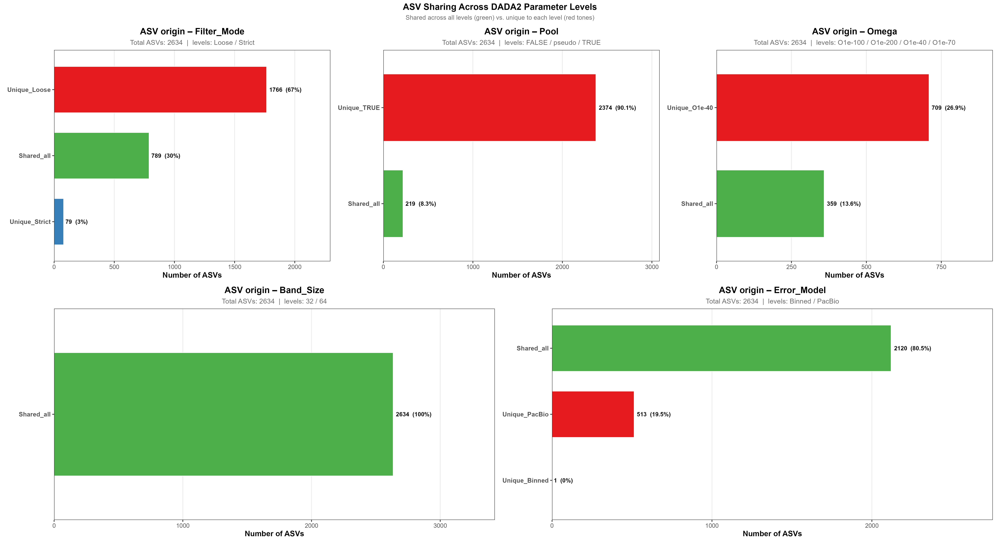
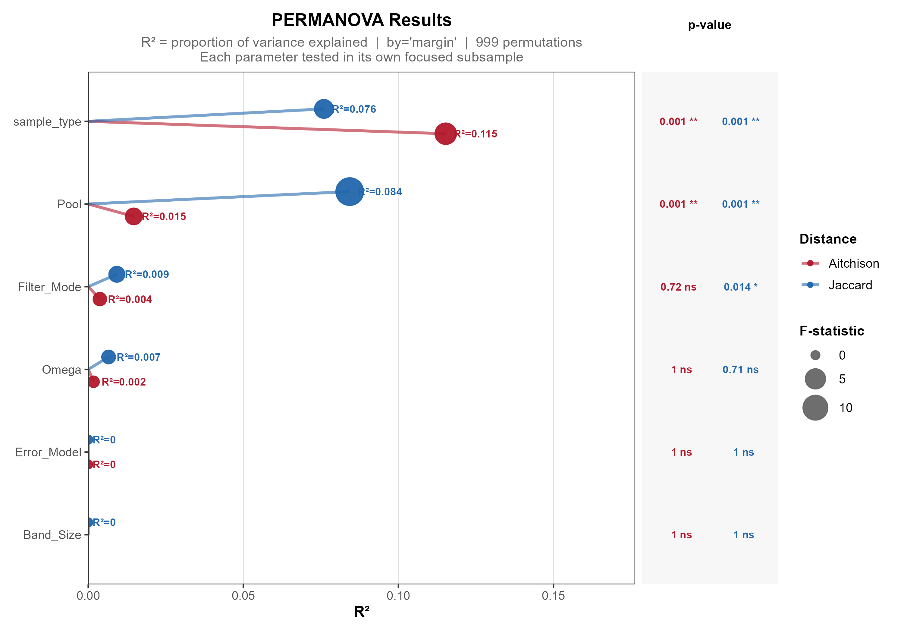
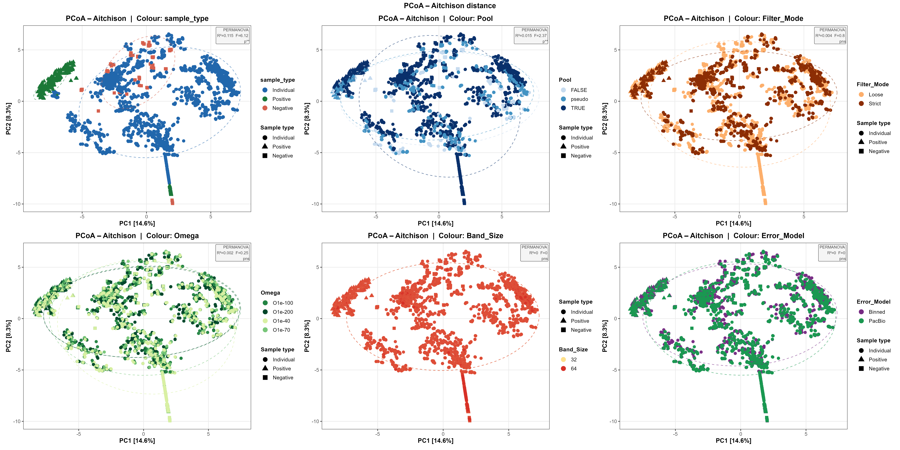
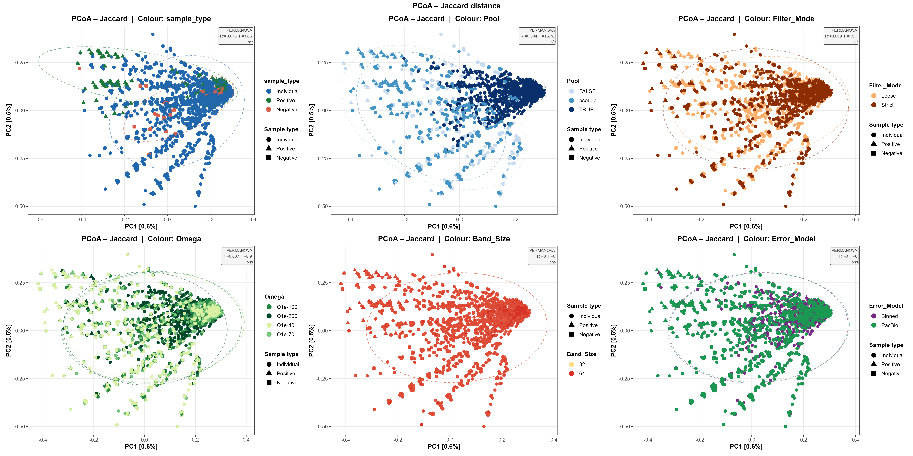

# 02 — Community Analyses

Community-level analysis of all 96 DADA2 parameter combinations, assessing how
parameter choice shapes the detected ASV community.

## Contents

| File | Description |
|------|-------------|
| `02_community_analyses.Rmd` | Main analysis notebook |
| `02_community_analyses_functions.R` | Companion functions |

---

## What this analysis does

1. Loads all 96 DADA2 output cases; removes pure mock controls; rarefies to 1 500 reads/sample
2. **ASV sharing analysis** — classifies ASVs as shared across or unique to each parameter level
3. **Distance matrices** — Jaccard (presence/absence) and Aitchison (CLR-Euclidean), cached to disk
4. **PERMANOVA** — tests each of the 6 parameters independently (999 permutations)
5. **PCoA ordination** — 6-panel plots for both distance metrics

## How to run

```bash
source start_env.sh
```
```r
rmarkdown::render("analysis/02_community_analyses/02_community_analyses.Rmd")
```

> Distance matrices are cached on first run. Set `FORCE_RECOMPUTE <- TRUE` to recompute.  
> Windows users: parallel loading is automatically disabled.

---

## Results

### ASV sharing

For each of the five DADA2 parameters, every ASV detected across all 96 cases is
classified as either **shared** (present regardless of which level of that parameter
is used) or **unique** (only appearing under one specific level). This first analysis
establishes which parameters drive the most change in the detected ASV set — without
yet determining whether those changes reflect true biology or noise.



**Key findings:**
- A clear hierarchy of parameter influence emerges
- **Pooling strategy** dominates: 90.1% of ASVs are unique to the `TRUE` pooling level — full pooling drives detection of a large number of sequences not recovered under any other strategy
- **Filter mode** shows a strong effect: 67% of ASVs are unique to the `Loose` setting, indicating that relaxing quality thresholds substantially inflates the detected ASV set
- **Omega** has a moderate-to-strong effect: 26.9% of ASVs are unique to the least stringent threshold (1e-40)
- **Error model** shows only moderate influence: PacBio produces 19.5% unique ASVs vs. Binned
- **Band size** has no detectable influence: 100% of ASVs are shared across both levels

> A high proportion of unique ASVs at a given level does not confirm whether those sequences represent true biology or noise — this requires the analyses below.

---

### PERMANOVA

To formally test whether the differences seen in ASV sharing are statistically
significant, a Permutational Multivariate Analysis of Variance (PERMANOVA) is
performed on two distance matrices — Jaccard and Aitchison — computed from the
merged phyloseq of all 96 cases. Each parameter is tested independently in a
focused subsample where all other parameters are fixed at a reference level,
allowing its individual contribution to community variance to be isolated.
Crucially, sample type (Individual / Positive / Negative) is included as a
variable so that pipeline effects can be directly compared against the true
biological signal.



**Key findings:**
- **Sample type** is the strongest driver of community structure (R²= 0.115 Aitchison, R²= 0.076 Jaccard, both p = 0.001) — true biological differences dominate over any pipeline-driven effects
- **Pooling strategy** is the only pipeline parameter with a strong and significant effect under both distance metrics
- Critically, the pooling effect is much stronger under **Jaccard** (R²= 0.084) than **Aitchison** (R²= 0.015). Since Jaccard is presence/absence-based and Aitchison is abundance-weighted, this discrepancy raises the possibility that the extra sequences introduced by `TRUE` pooling are predominantly low-abundance and may not represent genuine biological variants
- **Filter mode** reaches significance only under Jaccard (R²= 0.009, p = 0.014), consistent with the same pattern
- **Omega, error model, and band size** show no significant effect under either metric

---

### PCoA ordination

To visually explore the patterns driving the variance quantified by PERMANOVA,
Principal Coordinates Analysis (PCoA) is applied to both distance matrices. PCoA
projects sample dissimilarities into a low-dimensional space, making it possible
to see which samples cluster together and which separate — and therefore which
variables (biological or technical) are most responsible for structuring the data.
Six panels are produced per distance metric, one for each variable of interest.




**Key findings:**
- Under **Aitchison distance** (PC1 = 14.6%, PC2 = 8.3%), individuals, positive controls, and negative controls separate clearly — biology drives community structure more than pipeline choice
- `TRUE` pooling samples form a distinct trajectory along PC1 across all sample types, consistent with the possibility that full pooling introduces sequences shared across samples regardless of their true biological composition
- Under **Jaccard distance** (PC1 = 0.6%, PC2 = 0.6%), variance explained is very low so visual patterns should be interpreted cautiously. Nevertheless, `TRUE` pooling samples form a clearly distinct cluster, consistent with the PERMANOVA results
- Taken together, the stronger pooling effect under Jaccard than Aitchison across both PERMANOVA and PCoA raises the possibility that the extra ASVs introduced by `TRUE` pooling represent noise rather than true biological variants
- **Omega, band size, and error model** produce no visible clustering in either ordination

---

*Full methods in `02_community_analyses.Rmd` and the project report.*
