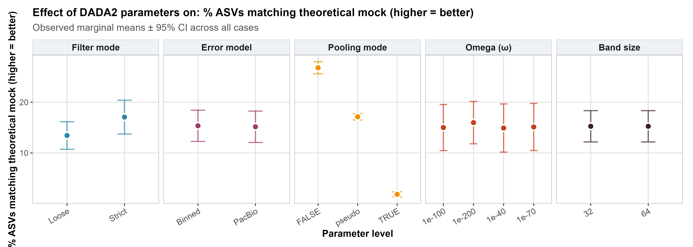
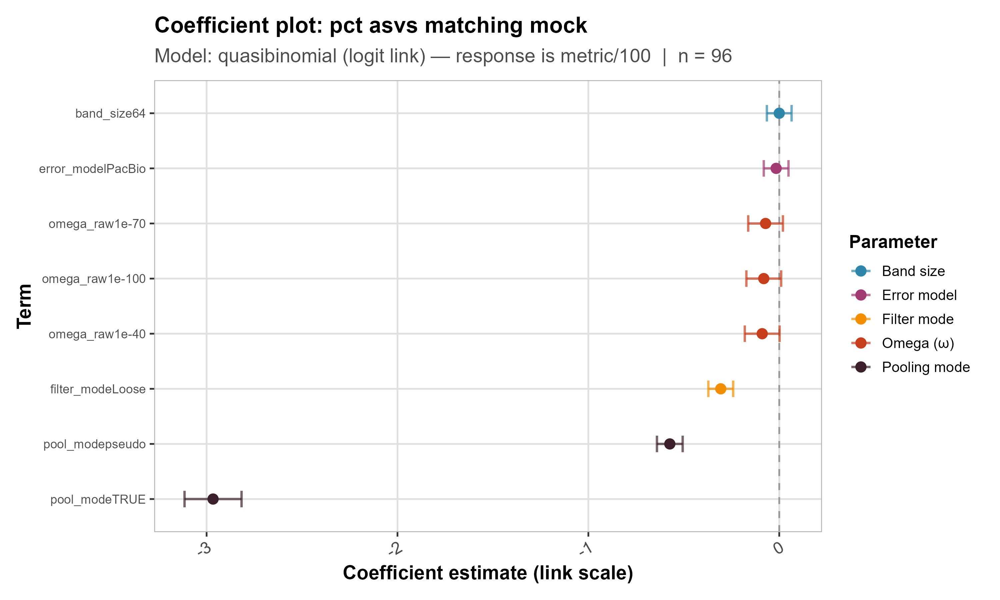
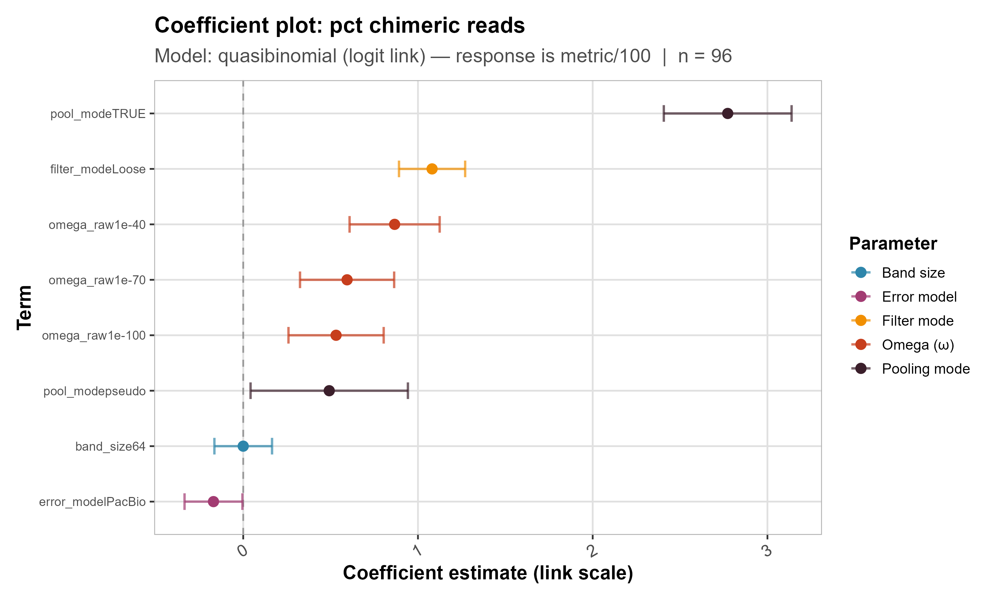
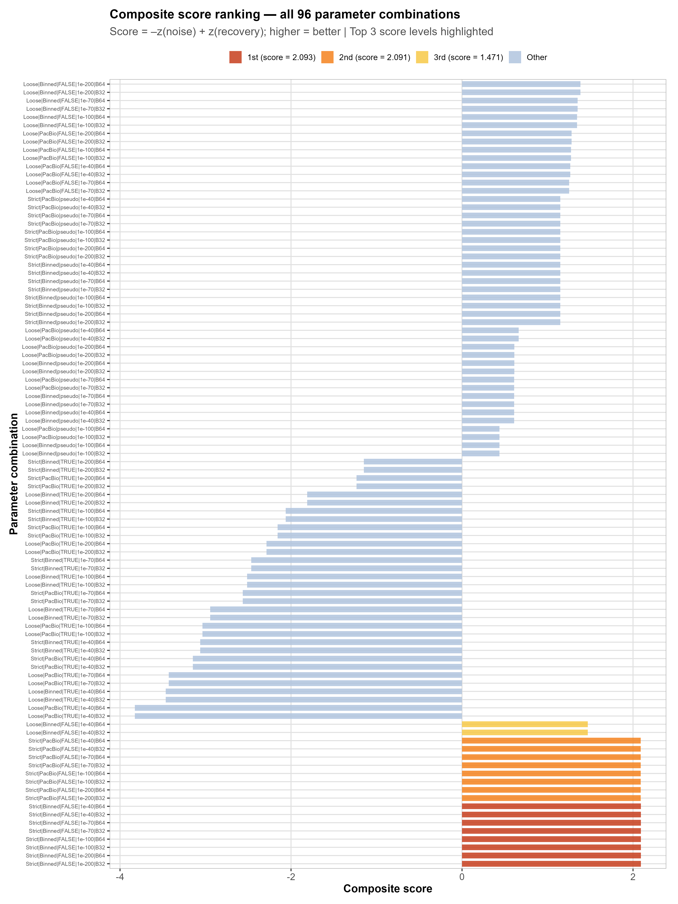

# 03 — Metric Modelling & Pipeline Ranking

Quality metrics computed on mock community samples only, modelled against the five
DADA2 parameters, and used to rank all 96 configurations. Two complementary
approaches — observed marginal means and regression models — are presented side by
side for each metric to cross-validate the findings.

## Contents

| File | Description |
|------|-------------|
| `Scripts/03_case_metric_modeling.Rmd` | Main analysis notebook |
| `Scripts/03_case_metric_modeling_functions.R` | Companion functions |

---

## What this analysis does

**Part 1 — Parameter effects on benchmark metrics**
1. Loads all 96 cases; rarefies to 1 500 reads/sample; computes quality metrics on mock samples only
2. Fits regression models per metric (quasibinomial GLM for proportions, Poisson GLM for counts)
3. Computes observed marginal means per parameter level

**Part 2 — Composite score ranking**

4. Ranks all 96 configurations using: `score = −z(noise) + z(recovery)`  
   where noise = % ASVs not matching mock and recovery = % reads from mock-matching ASVs
5. Identifies the top 3 distinct score levels (tie-aware)

## How to run

```bash
source start_env.sh
```
```r
rmarkdown::render("analysis/03_metric_modelling/Scripts/03_case_metric_modeling.Rmd")
```

> IUPAC ambiguity codes in reference sequences are handled correctly (e.g. `V` in ESBL15 = A, C, or G).  
> Composite score weighting (1:1) can be adjusted via `weight_noise` and `weight_recovery`.

---

## Results

For each of the three key quality metrics, two complementary representations are
shown side by side: **marginal means** (observed group averages ± 95% CI — direct
and interpretable without model back-transformation) and **regression model
coefficients** (estimated effect size on the link scale, controlling for all other
parameters simultaneously). The agreement between both approaches provides
cross-validated evidence for the hierarchy of parameter effects.

---

### Metric 1 — % ASVs matching the theoretical mock (higher = better)

This metric measures **pipeline precision**: what fraction of the ASVs inferred
in the mock samples actually correspond to one of the four expected reference
sequences. It is computed at the ASV level because each spurious sequence
represents a distinct false positive regardless of its read count.




**Key findings:**
- Both approaches consistently identify the same hierarchy, increasing confidence in the results
- **Pooling strategy** has the strongest effect: `TRUE` pooling drops accuracy to ~1.86% vs. ~26.77% under `FALSE` — a dramatic reduction driven by the large number of non-mock sequences introduced. The GLM coefficient for `pool_modeTRUE` is the largest negative estimate by a wide margin
- **Filter mode** shows a clear effect: `Strict` yields higher accuracy than `Loose`
- **Omega** shows moderate effects in the expected direction — less stringent thresholds produce slightly lower accuracy
- **Error model** shows a small but consistent effect: PacBio produces slightly fewer mock-matching ASVs than Binned
- **Band size** shows no detectable effect

---

### Metric 2 — % chimeric reads in mock (lower = better)

This metric quantifies the proportion of reads assigned to chimeric ASVs —
artificial sequences formed by the mis-joining of fragments from different parent
molecules during PCR amplification. Although chimera removal is applied by DADA2,
residual chimeric reads can remain depending on upstream parameter choices.




**Key findings:**
- The same hierarchy as metric 1 is confirmed by both marginal means and the GLM
- **Pooling strategy** dominates: `TRUE` pooling shows the highest chimeric read rate (~0.36%)
- **Filter mode**: `Loose` produces notably higher chimeric read proportions than `Strict`
- Importantly, **absolute chimeric read values remain low across all parameter levels** — even under the worst-case combination, chimeric reads represent a small fraction of total reads. Chimera removal functions effectively regardless of upstream parameter choices and chimera formation is not a major concern in this dataset. The relative differences are statistically real but biologically of limited consequence
- **Band size** and **error model** are close to zero in both representations

---

### Metric 3 — Total observed ASVs in mock samples (lower = better)

This metric captures the **overall output size** of the pipeline on mock samples.
Since the theoretical mock contains only 4 known sequences, any pipeline producing
a large number of ASVs from mock samples is necessarily generating spurious
sequences. A well-performing pipeline should produce an ASV count as close to 4
as possible.


**Key findings:**
- **Pooling strategy** dominates: `TRUE` pooling produces on average ~345 total ASVs vs. ~13.5 under `FALSE` — over 25× more. Since the theoretical mock contains only 4 sequences, the vast majority cannot represent true biological signal
- **Filter mode**: `Loose` produces nearly twice as many total ASVs as `Strict`
- **Omega** shows moderate effects in the expected direction: less stringent thresholds produce more ASVs
- **Band size** shows no effect

---

### Overview heatmap

To consolidate all three metrics into a single comparable view, a heatmap of
normalised marginal means is produced. Each cell shows the raw mean value; colour
is normalised within each metric row on a 0–1 scale, allowing cross-metric
comparison of relative effects despite different units and scales.


**Key findings:**
- Confirms that the same pattern holds across all three metrics simultaneously
- The **Pool** column shows the most extreme colour contrast: `TRUE` pooling is deep red for total ASVs (345.12) and deep blue for mock-matching accuracy (1.86%)
- **Band size** columns are identical across all metrics — the clearest visual confirmation of its absence of effect
- **Filter**: `Strict` is consistently better than `Loose` across all three metrics

---

### Pipeline ranking — noise vs. recovery scatter

Having characterised each parameter's effect individually, all 96 configurations
are now ranked simultaneously on two complementary dimensions that cannot be
optimised in isolation: **noise** (% ASVs not matching the theoretical mock,
at the ASV level — each spurious sequence is a distinct false positive) and
**biological recovery** (% reads from mock-matching ASVs, at the read level —
reflecting how much of the true signal is retained). A composite score
`score = −z(noise) + z(recovery)` is computed, penalising noise and rewarding
recovery with equal weight, to rank all 96 configurations objectively.


**Key findings:**
- A clear cluster of better-performing combinations is visible towards the top-left (low noise, high recovery)
- Noise control is the primary differentiator: top combinations are well separated from others on the x-axis, while differences in recovery are comparatively smaller
- The worst-performing combinations correspond overwhelmingly to `TRUE` pooling cases

---

### Full ranking — all 96 cases

The scatter plot above makes the top cluster visible but formal discrimination
between closely ranked configurations requires the composite score. The bar chart
below shows all 96 combinations ranked by their composite score, with the top 3
distinct score levels highlighted, revealing which parameter combinations share
equivalent performance and what drives the ranking.



**Key findings:**
- The first and second score levels are nearly identical (2.093 vs. 2.091)
- All top-ranked combinations share **Strict filtering** and **FALSE pooling** — the critical determinants. They differ only in Omega and band size, consistent with the negligible influence of those parameters
- The second rank group uses PacBio instead of Binned, producing a negligible score difference
- All `TRUE` pooling configurations cluster at the bottom regardless of other parameters
- **Optimal pipeline: `Strict filtering · Binned error model · FALSE pooling`**

---

*Full methods in `Scripts/03_case_metric_modeling.Rmd` and the project report.*
