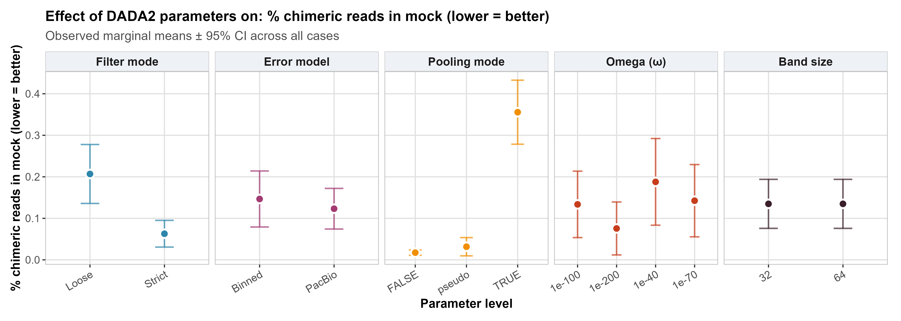
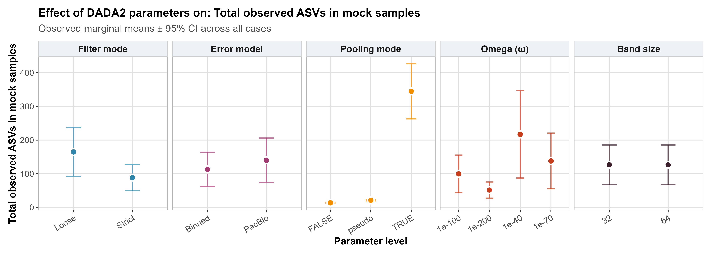
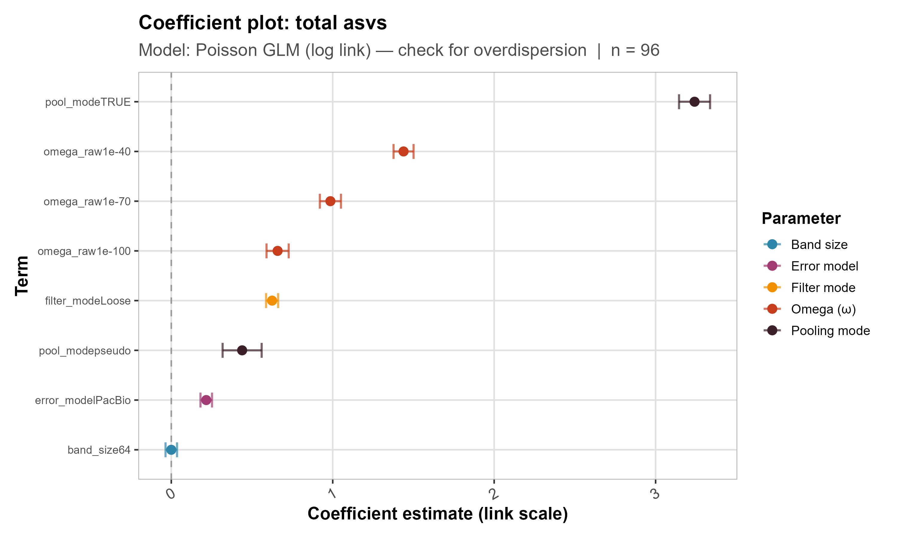
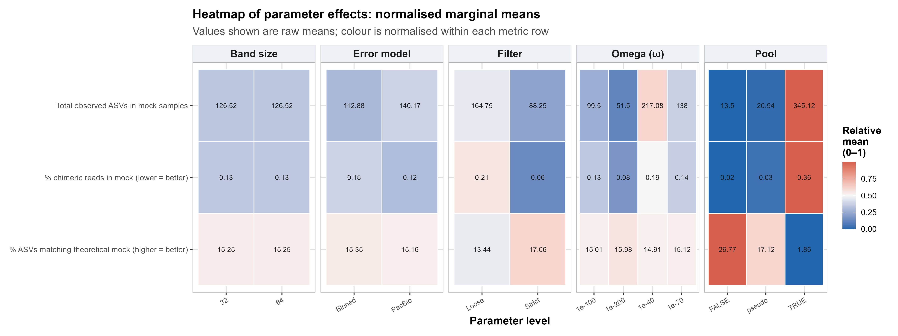
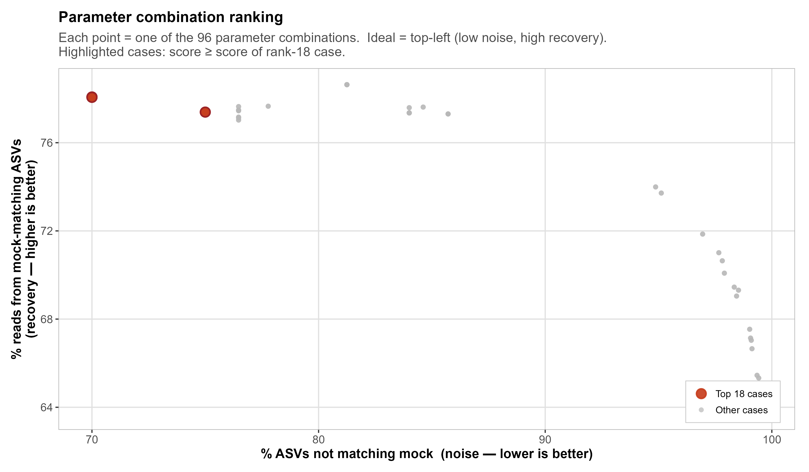

# Results — Metric Modelling & Pipeline Ranking

Quality metrics computed on mock community samples only, modelled against the five
DADA2 parameters, and used to rank all 96 pipeline configurations. Two complementary
approaches — observed marginal means and regression models — are presented side by
side for each metric to cross-validate the findings.

---

## Metric 1 — % ASVs matching the theoretical mock (higher = better)

The marginal means plot shows observed group averages ± 95% CI for each parameter level.
The coefficient plot shows the estimated effect of each level relative to its reference
(quasibinomial GLM, logit link, n = 96); coefficients to the left of zero indicate a
reduction in mock-matching accuracy (i.e. more noise).

**Key findings:**
- Both the marginal means and the model consistently identify the same hierarchy of effects, increasing confidence in the results
- **Pooling strategy** has by far the strongest effect: `TRUE` pooling drops mock-matching accuracy to ~1.86% on average, compared to ~26.77% under `FALSE` pooling — a dramatic reduction driven by the large number of non-mock sequences introduced under full pooling. The GLM coefficient for `pool_modeTRUE` is the largest negative estimate by a wide margin
- **Filter mode** shows a clear and consistent effect: `Strict` filtering yields higher mock-matching accuracy than `Loose`, reflected both in the marginal means gap and the negative coefficient for `filter_modeLoose`
- **Omega** shows moderate effects in the expected direction — less stringent thresholds (1e-40) produce slightly lower accuracy — but the differences are small compared to pooling and filtering
- **Error model** shows a small but consistent effect: PacBio produces slightly fewer mock-matching ASVs than Binned
- **Band size** shows no detectable effect in either the marginal means or the model

---

## Metric 2 — % chimeric reads in mock (lower = better)

**Key findings:**
- The same hierarchy of effects is observed as for mock-matching accuracy, again confirmed by both marginal means and the GLM
- **Pooling strategy** dominates: `TRUE` pooling shows the highest chimeric read rate (~0.36%), followed by `pseudo` and `FALSE`
- **Filter mode** shows a clear effect: `Loose` filtering produces notably higher chimeric read proportions than `Strict`
- However, it is important to note that **absolute chimeric read values remain low across all parameter levels** — even under the worst-case combination, chimeric reads represent a small fraction of total reads. This indicates that chimera removal functions effectively regardless of upstream parameter choices and that chimera formation is not a major concern in this dataset. The relative differences observed are statistically real but biologically of limited consequence
- **Band size** and **error model** coefficients are close to zero and not meaningfully different from the reference level

---

## Metric 3 — Total observed ASVs in mock samples (lower = better)

**Key findings:**
- **Pooling strategy** again dominates both plots: `TRUE` pooling produces on average ~345 total ASVs in mock samples — over 25 times more than `FALSE` pooling (~13.5). Since the theoretical mock contains only 4 sequences, the vast majority of these additional ASVs cannot represent true biological signal
- **Filter mode** shows a strong effect: `Loose` filtering produces nearly twice as many total ASVs as `Strict`, consistent with less aggressive removal of low-quality reads introducing more spurious sequences
- **Omega** shows a moderate effect in the expected direction: less stringent thresholds produce more ASVs
- **Band size** shows no effect; the two Poisson GLM coefficients are indistinguishable from zero

---

## Overview heatmap — all metrics × all parameters

Normalised marginal means across all three metrics and all five parameters. Raw values
are shown in each cell; colour is normalised within each metric row (0–1 scale) to
allow visual comparison of relative effects across parameters.

**Key findings:**
- The heatmap consolidates all of the above into a single view, confirming that the same pattern holds across all three metrics simultaneously
- The **Pool** column shows the most extreme colour contrast of any parameter: `TRUE` pooling is deep red for total ASVs (345.12) and deep blue for mock-matching accuracy (1.86%), while `FALSE` pooling is the opposite — the clearest visual summary of why pooling dominates pipeline performance
- The **Band size** columns are identical across all three metrics, visually confirming its complete absence of effect
- The **Filter** column shows a consistent and interpretable pattern: `Strict` is always better than `Loose` across all three metrics

---

## Pipeline ranking

### Ranking scatter — noise vs. recovery

Each point represents one of the 96 parameter combinations, positioned by its two
decision metrics: % ASVs not matching the mock (noise, x-axis; lower is better) and
% reads from mock-matching ASVs (recovery, y-axis; higher is better). The ideal
combination occupies the **top-left** corner. The top 18 cases by composite score
are highlighted in red.

A composite score was computed to rank all 96 configurations simultaneously on both
dimensions:

> **score = −z(noise) + z(recovery)**

where z-scores are calculated across all 96 cases. This formulation penalises noise
and rewards recovery with equal weight, and is expected to be robust to reasonable
alternative weight choices given the large absolute differences between parameter classes.

**Key findings:**
- A clear cluster of better-performing combinations is visible towards the top-left, combining lower noise with higher recovery
- The top-performing combinations are well separated from the rest of the field on the noise axis, while differences in recovery are comparatively smaller — confirming that noise control is the primary differentiator between the best and worst configurations
- The worst-performing combinations (bottom-right) correspond overwhelmingly to `TRUE` pooling cases, consistent with all previous analyses

---

### Full ranking — all 96 cases

All 96 parameter combinations ranked by composite score. The top 3 distinct score
levels are highlighted: 1st (score = 2.093, dark red), 2nd (score = 2.091, orange),
3rd (score = 1.471, yellow).

**Key findings:**
- The first and second score levels are nearly identical (2.093 vs. 2.091), indicating a group of configurations that perform equivalently at the top
- All top-ranked combinations share **Strict filtering** and **FALSE pooling** — these are the critical determinants. They differ only in Omega and band size, consistent with the earlier finding that these parameters have negligible influence on performance
- The second rank group uses the PacBio error model instead of Binned, producing a negligible score difference consistent with the small but consistent error model effect observed in the models
- All `TRUE` pooling configurations cluster at the bottom of the ranking, regardless of how the other parameters are set — confirming that pooling strategy is the dominant driver of poor pipeline performance
- The **optimal pipeline** identified is: `Strict filtering · Binned error model · FALSE pooling`

---

*Figures generated by `03_case_metric_modeling.Rmd`. Full methods in the companion script and the project report.*
