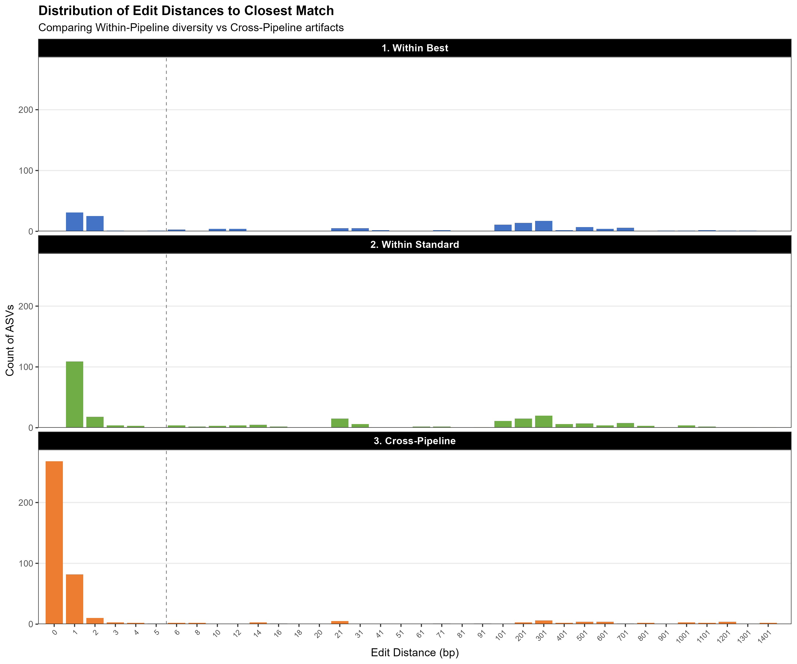
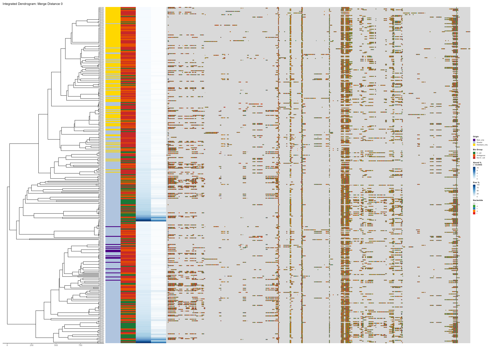
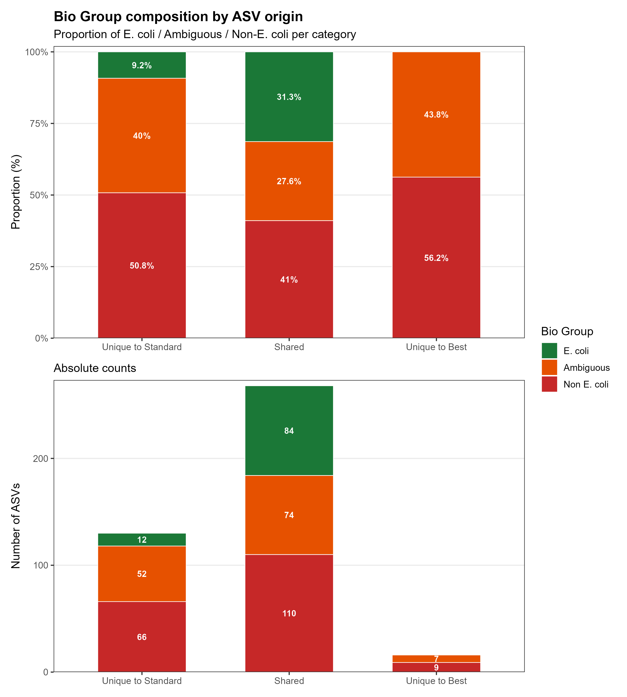

# 04 — Best vs Standard Pipeline Comparison

Direct sequence-level and biological comparison of the BEST pipeline
(`Strict · Binned · FALSE pooling`) against the STANDARD pipeline
(`Loose · PacBio · FALSE pooling`).

## Contents

| File | Description |
|------|-------------|
| `Scripts/04_BEST_vs_STANDARD.Rmd` | Main analysis notebook |
| `Scripts/04_functions.R` | Companion functions |

## Pipeline parameters

| Parameter | BEST | STANDARD |
|-----------|------|----------|
| Filtering | Strict (maxEE = 0.5) | Loose (maxEE = 2) |
| Error model | Binned | PacBio |
| Pooling | FALSE | FALSE |
| Omega | 1e-200 | 1e-40 |
| Band size | 32 | 32 |

---

## What this analysis does

1. Extracts ASV sequences from each pipeline; computes pairwise edit distance matrix (DECIPHER + pwalign Hamming) — cached to disk
2. Writes split FASTA files for NCBI BLAST submission (manual step)
3. Parses BLAST JSON results; assigns 5-tier trust system per ASV
4. **Figure 1** — Edit distance distributions: within-Best, within-Standard, cross-pipeline
5. **Figure 2** — Integrated dendrogram: clustering + trust tiers + abundance + alignment
6. **Figure 3** — Bio Group composition by ASV origin

## How to run

```bash
source start_env.sh
```

1. Knit sections 0–5 to generate split FASTA files
2. Submit each to [NCBI BLAST](https://blast.ncbi.nlm.nih.gov) → download *Single-file JSON2* → save into `data/blast/JSON/`
3. Knit sections 6–11 to complete the analysis

> ⚠️ **BLAST is a manual step** — full instructions in the Rmd section 3b.  
> The edit distance matrix is cached; delete `cached_edit_distance_matrix.rds` to recompute.  
> Figure 2 is large (28 × 20 inches) and may take several minutes to render.

---

## Results

### Figure 1 — Edit Distance Distributions

To assess how similar or different the ASV sequences produced by each pipeline are
at the sequence level, pairwise edit distances (minimum number of base-pair
substitutions, insertions, or deletions between two sequences) are computed for
all ASVs combined. Three comparisons are made: within the BEST pipeline, within
the STANDARD pipeline, and cross-pipeline. This reveals whether each pipeline
produces internally similar or diverse sequences, and how many ASVs are shared
vs. unique between approaches.



**Key findings:**
- **Within BEST**: very few ASVs at edit distance 1, suggesting DADA2 has effectively collapsed near-identical sequences under Strict filtering
- **Within STANDARD**: a substantially larger peak at edit distance 1 (~110 ASVs). ASVs differing by only 1 bp from another in the same dataset are potentially denoising artefacts — this raises the possibility that a portion of the Standard pipeline's additional ASVs represent residual noise, though further validation would be needed to confirm this
- **Cross-pipeline**: a large peak at edit distance 0 (~260 ASVs) corresponds to sequences shared by both pipelines; a substantial number of sequences have no identical counterpart in the other pipeline, indicating meaningful divergence in the two ASV sets

---

### Figure 2 — Integrated Dendrogram

To assess the biological validity of ASVs from each pipeline, all sequences are
submitted to NCBI BLAST and classified into a 5-tier trust system based on the
identity and coverage of their hits against *E. coli*. The integrated dendrogram
then combines hierarchical clustering by sequence similarity with annotation tracks
for pipeline origin, trust tier, abundance, prevalence, and nucleotide composition.
This allows visual assessment of whether pipeline-exclusive ASVs are biologically
supported or represent spurious sequences.

**Biological validation — trust tier system:**

| Tier | Definition |
|------|-----------|
| 1 | All hits: 100% identity + 100% coverage to *E. coli*, or exact WGS match |
| 2 | At least one perfect *E. coli* hit, but not all |
| 3 | No perfect hits; all hits relate to *E. coli* |
| 4 | No perfect hits; mixed *E. coli* and non-*E. coli* taxonomy |
| 5 | No *E. coli* hits at all |

Collapsed for downstream analyses: **E. coli** (Tiers 1–2) · **Ambiguous** (Tiers 3–4) · **Non-E. coli** (Tier 5)



**Key findings:**
- The most abundant and prevalent ASVs are predominantly classified as **E. coli** and are **shared between both pipelines**, confirming that the core biological signal is robustly captured by both approaches
- ASVs unique to the Standard pipeline (yellow strip) are predominantly low abundance, low prevalence, and enriched for Non-*E. coli* and Ambiguous groups — consistent with the possibility that these represent noise or sequences of uncertain biological origin
- ASVs unique to the Best pipeline (purple strip) are very few in absolute number
- The nucleotide composition panel reveals the sequence-level diversity underlying the clustering, with dominant shared *E. coli* ASVs showing distinct conserved per-position profiles

---

### Figure 3 — Bio Group Composition by ASV Origin

To quantify the biological composition differences seen in the dendrogram, ASVs
are grouped by their pipeline origin (Unique to Standard, Shared, Unique to Best)
and the proportion and absolute count of each biological group (E. coli, Ambiguous,
Non-E. coli) within each category is plotted. This provides a direct, quantitative
summary of the sensitivity–specificity trade-off between the two pipelines.



**Key findings:**
- **Shared ASVs** have the highest proportion of validated *E. coli* sequences (31.3%, n = 84), confirming that the core signal captured by both pipelines is predominantly real biology
- **ASVs unique to Standard**: only 9.2% are *E. coli* (n = 12), while 50.8% are Non-*E. coli* (n = 66) and 40% Ambiguous (n = 52) — over 90% lack reliable biological validation as true *E. coli* sequences
- **ASVs unique to Best**: negligible in absolute terms (n = 16 total)
- These results reveal a clear **sensitivity–specificity trade-off**: the Standard pipeline recovers a small amount of additional true *E. coli* diversity (12 extra validated ASVs) at the cost of substantially more sequences of uncertain origin. The Best pipeline provides a cleaner and more conservative output, though the possibility that it discards a small number of genuinely rare *E. coli* variants cannot be excluded

---

*Full methods in `Scripts/04_BEST_vs_STANDARD.Rmd` and the project report.*
