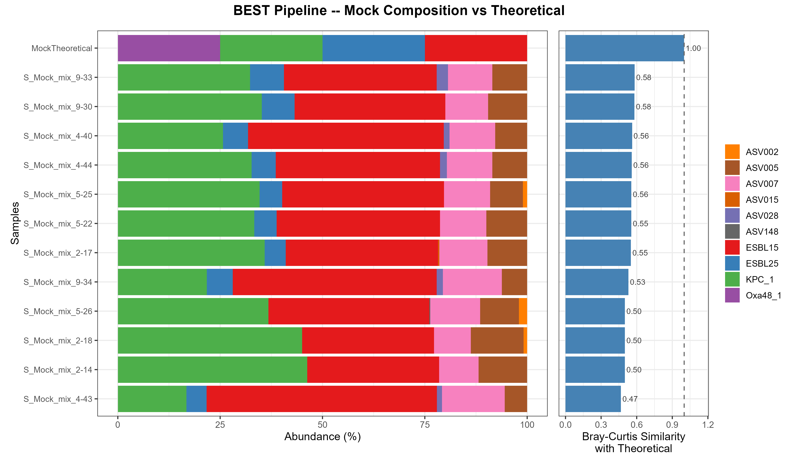

# 05 — Mock Community QC

Quality control of the experimental mock community positive controls. The theoretical
mock consists of exactly **4 known *E. coli* fliC sequences** (ESBL15, ESBL25, KPC_1,
Oxa48_1), each expected at approximately 25% relative abundance. Any deviation —
additional sequences or absence of expected ones — indicates pipeline noise, biological
contamination from wet-lab steps, or both.

## Contents

| File | Description |
|------|-------------|
| `Scripts/05_Mock_Distributions.Rmd` | Main analysis notebook |
| `Scripts/05_Mock_Distributions_Functions.R` | Companion functions |

---

## What this analysis does

1. Loads the theoretical mock reference (`ps_mock_trimmed_4.rds`)
2. Extracts all mock samples — Mock Mix (`S_Mock_mix*`) and Singular Mocks (`S_KPC1`, `S_Oxa`, `S_E15`, `S_E25`) — combined into a single phyloseq
3. Assigns taxonomy to experimental ASVs by pairwise alignment against the 4 theoretical reference sequences
4. Computes Bray-Curtis similarity between each experimental sample and the theoretical composition
5. Produces stacked composition plots alongside BC similarity values for both pipelines

> **Why not `checkZymoBiomics()`?** That function uses `DECIPHER::IdTaxa` against the
> 8-species Zymo training set, which returns all-NA taxonomy for this project's 4-taxon
> reference. The approach here replicates the same logic using project-specific reference
> sequences, and uses Bray-Curtis rather than Spearman correlation (Spearman = 0 when all
> 4 strains are at equal 25% abundance).

## How to run

```bash
source start_env.sh
```
```r
rmarkdown::render("analysis/05_mock_qc/Scripts/05_Mock_Distributions.Rmd")
```

> This step does not depend on steps 02–04 and can be run independently.

---

## Results

To assess how faithfully the experimental mock samples reflect the expected theoretical
composition, two complementary visualisations are produced for each pipeline: a **stacked
barplot** showing the relative abundance of every detected ASV per sample (coloured by
identity), and a **Bray-Curtis similarity bar** quantifying how close each sample is to
the theoretical reference in a single number. A Bray-Curtis similarity of 1.0 (dashed line)
would indicate a perfect match; values below 1.0 reflect the presence of unexpected
sequences or the absence of expected ones.

### BEST Pipeline



### STANDARD Pipeline


---

### Key findings

**Unexpected sequences are present in both pipelines**
- Both pipelines detect a substantial number of ASVs beyond the four expected theoretical sequences
- Some unexpected sequences appear consistently at relatively high abundance across multiple replicates — unlikely to be computational artefacts and may instead reflect **biological contamination introduced during the molecular biology workflow** (DNA extraction, PCR, or library preparation)
- Others appear at low abundance and low prevalence, more consistent with residual computational noise
- The STANDARD pipeline produces considerably more unexpected ASVs than the BEST pipeline, consistent with its more permissive parameters

**Loss of Oxa48_1 in the BEST pipeline**
- Oxa48_1 is not recovered at meaningful levels by the BEST pipeline, which fails to detect it in most samples
- The STANDARD pipeline recovers Oxa48_1 at low abundance in several replicates
- This points to a potential issue in mock community preparation (low concentration or degradation of this strain's DNA) rather than a purely computational limitation
- This is an additional data point supporting the sensitivity difference: stricter parameters discard low-abundance sequences — together with the spurious sequences they would otherwise generate

**The sensitivity–specificity trade-off is reinforced**
- The STANDARD pipeline achieves marginally higher biological recovery — evidenced by partial detection of Oxa48_1 — at the cost of substantially more potentially spurious sequences
- Neither pipeline achieves Bray-Curtis similarity above ~0.61; no sample reaches 1.0

**Contamination source — post-experiment corroboration**
- The consistent presence of unexpected sequences across mock replicates raises the possibility of contamination introduced during the wet-lab workflow
- This was **corroborated by subsequent experiments**: a parallel run using a non-Kinnex library preparation on the same amplicons produced substantially cleaner results, with only the four expected ASVs detected at ~25% each — strongly implicating the **Kinnex library preparation protocol** as the contamination source
- Some noise attributed to pipeline parameters in earlier analyses may therefore have been partly driven by this contamination. Critically, however, **relative pipeline comparisons remain valid** since all 96 configurations were applied to the same biological material under identical conditions

---

*Full methods in `Scripts/05_Mock_Distributions.Rmd` and the project report.*
