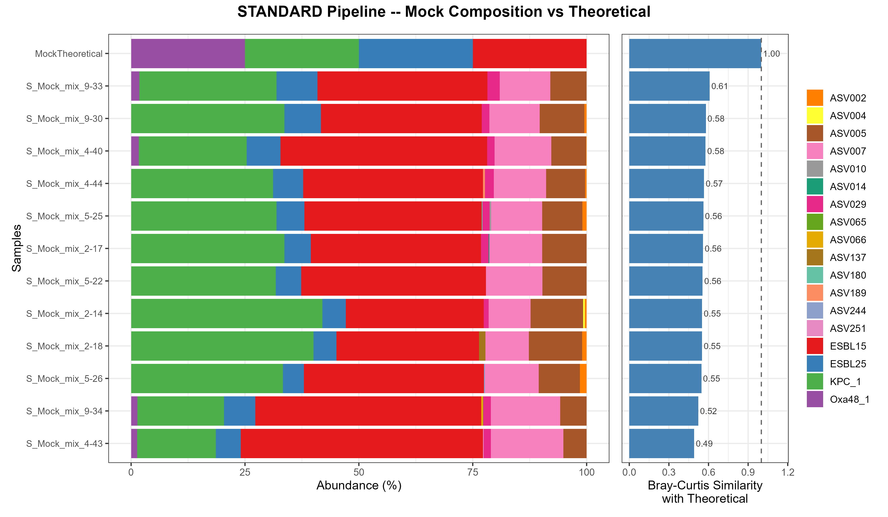

# Results — Mock Community QC

Quality control of the experimental mock community positive controls.
The theoretical mock consists of exactly **4 known *E. coli* fliC sequences**
(ESBL15, ESBL25, KPC_1, Oxa48_1), each expected at approximately 25% relative
abundance. Any deviation from this — additional sequences or absence of expected
ones — indicates either pipeline noise, biological contamination introduced during
wet-lab steps, or both.

---

## BEST Pipeline — Mock Composition vs Theoretical

## STANDARD Pipeline — Mock Composition vs Theoretical

Left panel: stacked barplot of ASV composition per sample (%). The top row
(`MockTheoretical`) shows the expected composition. Right panel: Bray-Curtis
similarity of each experimental mock sample against the theoretical reference
(dashed line = perfect agreement at 1.0).

---

## Key findings

**Unexpected sequences are present in both pipelines**
- Both the BEST and STANDARD pipelines detect a substantial number of ASVs beyond the four expected theoretical sequences across all mock samples
- Among these unexpected sequences, some appear consistently at relatively high abundance across multiple replicates, suggesting they are unlikely to be computational artefacts and may instead reflect **biological contamination introduced during the molecular biology workflow** — such as during DNA extraction, PCR amplification, or library preparation
- Others appear at low abundance and low prevalence, more consistent with residual computational noise that neither pipeline fully resolves
- The STANDARD pipeline produces a considerably higher number of unexpected ASVs compared to the BEST pipeline, consistent with its more permissive parameters generating more potentially spurious sequences

**Loss of Oxa48_1 in the BEST pipeline**
- The Oxa48_1 sequence — one of the four expected theoretical mock sequences — is **not recovered at meaningful levels by the BEST pipeline**, which fails to detect it in most samples
- The STANDARD pipeline recovers Oxa48_1, albeit at low abundance, in several replicates
- This points to a potential issue in mock community preparation — such as low concentration or degradation of this particular strain's DNA — rather than a purely computational limitation
- This observation constitutes an additional data point supporting the sensitivity difference between the two pipelines: the stricter parameters of the BEST pipeline discard low-abundance sequences that the STANDARD pipeline retains, at the cost of also generating more spurious sequences alongside them

**The sensitivity–specificity trade-off is reinforced**
- These results confirm the trade-off identified in step 04: the STANDARD pipeline achieves marginally higher biological recovery — evidenced here by its partial detection of Oxa48_1 — at the cost of generating a considerably larger number of potentially spurious sequences
- Neither pipeline achieves Bray-Curtis similarity values above ~0.61 against the theoretical mock; no sample reaches the dashed line at 1.0, reflecting the presence of unexpected sequences in all replicates regardless of pipeline

**Potential contamination and post-experiment corroboration**
- The presence of unexpected sequences that appear consistently across mock replicates at non-negligible abundance raises the possibility that contamination was introduced at some point during the wet-lab workflow
- Importantly, **this was corroborated by subsequent experiments**: a parallel sequencing run using a non-Kinnex library preparation on the same pool of amplicons produced substantially cleaner results, with only the four expected ASVs detected consistently at ~25% each. This strongly suggests that the **Kinnex library preparation protocol** was the source of the contamination observed throughout this study
- This finding means that some of the noise attributed to pipeline parameters in earlier analyses may have been partly driven by this contamination, and that the absolute benchmarking values should be interpreted with this caveat in mind. Critically, however, the relative comparisons between pipelines remain valid, since all 96 configurations were applied to the same biological material under identical experimental conditions

---

*Figures generated by `05_Mock_Distributions.Rmd`. Full methods in the companion script and the project report.*
