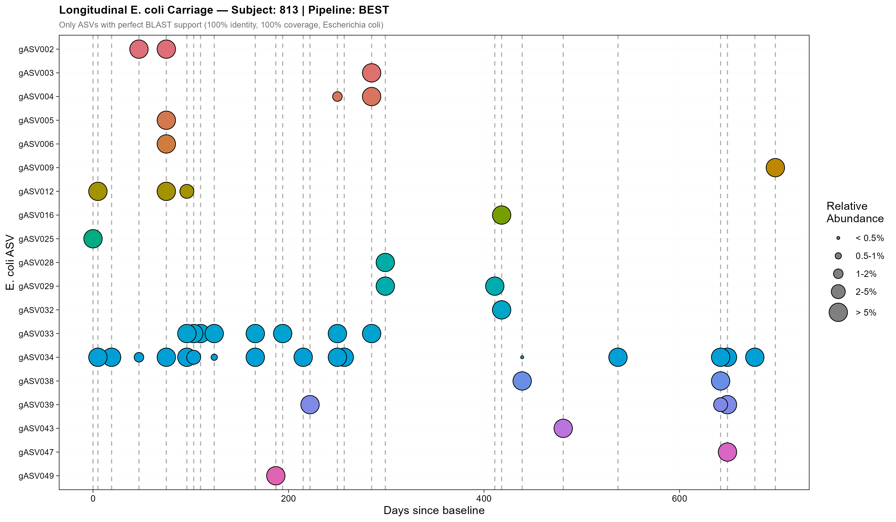
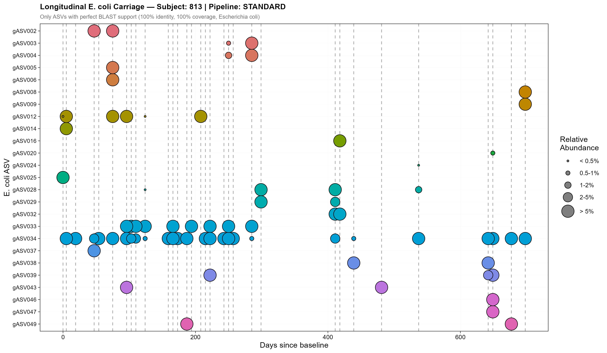

# Results — Longitudinal E. coli ASV Carriage

Longitudinal carriage profiling of *E. coli* ASVs across repeated faecal samples
from Subject 813 — the individual with the longest follow-up (~650 days) and the
richest carriage pattern in the cohort. Only ASVs with **perfect BLAST support**
(100% identity, 100% query coverage, *Escherichia coli* annotation) are shown.

Each row is one *E. coli* ASV (global identifier). Each bubble indicates a detection
at a given timepoint; bubble size encodes relative abundance among all *E. coli fliC*
reads at that timepoint. Vertical dashed lines mark all sampled timepoints — empty
spaces indicate absence of detection, not absence of sampling.

---

## Subject 813 — BEST Pipeline

## Subject 813 — STANDARD Pipeline

---

## Key findings

**Both pipelines recover the same dominant persistent strains**
- A core set of high-abundance ASVs — most notably **gASV034** and **gASV033** — is consistently detected across multiple timepoints spanning the full follow-up period in both pipelines, with large bubble sizes indicating they constitute a major fraction of the *E. coli* community at each timepoint
- This convergence on the dominant strains is the most important result: it confirms that the primary biological signal — the *E. coli* strains that truly colonise and persist in this individual — is robustly captured regardless of pipeline choice
- Several other ASVs (e.g. gASV002, gASV012, gASV028, gASV029) also appear at comparable timepoints and abundances in both pipelines, further supporting that the core carriage pattern is reproducible

**The STANDARD pipeline detects more ASVs and extends temporal coverage**
- The STANDARD pipeline recovers a higher number of distinct *E. coli* ASVs overall, and captures some strains across a greater number of timepoints
- Several ASVs visible in the STANDARD plot are absent or detected at fewer timepoints in the BEST plot — particularly low-abundance, isolated detections (tiny bubbles appearing at single timepoints)
- This is consistent with the higher sensitivity of the STANDARD pipeline identified in the mock community benchmarking, where it retained more true *E. coli* signal at the cost of more noise

**Interpretation of additional detections in the STANDARD pipeline**
- The additional detections unique to the STANDARD pipeline are predominantly low-abundance and appear at isolated timepoints, making their biological interpretation uncertain
- Several explanations are possible and cannot be distinguished without paired WGS data: they could represent genuine but transient colonisation episodes that failed to establish, very brief carriage events at the limit of detection, or *E. coli* contamination introduced during wet-lab steps — which would pass the perfect BLAST filter precisely because it constitutes a real *E. coli fliC* sequence
- Even strains genuinely present in the gut may not be consistently recovered across all faecal samples due to uneven spatial distribution within the gut or stochastic variation during DNA extraction

**Pipeline choice does not affect the core biological conclusion**
- Taken together, both pipelines support the same interpretation of *E. coli* strain dynamics in Subject 813: a small number of dominant strains are persistently carried over the full follow-up period, with additional lower-abundance ASVs appearing transiently
- The difference between pipelines lies in the detection of these low-abundance, low-prevalence variants — and whether those represent true biology or noise cannot be resolved from amplicon data alone. Validation against paired whole-genome sequencing data from the same individual and timepoints represents the most important direction for future work

---

*Figures generated by `06_Longitudinal_Carriage.Rmd`. Full methods in the companion script and the project report.*

---

## Pipeline recommendation

The choice between pipelines should be guided by the biological question being addressed:

- **If high sensitivity is the priority** — for example to detect rare or transient colonisation events, capture low-abundance strains, or maximise *E. coli* diversity recovery — the **STANDARD pipeline** is the more appropriate choice. It recovers more ASVs and provides broader temporal coverage, though additional validation of low-confidence detections is necessary and the higher number of ASVs generated increases the downstream computational and manual curation burden.

- **If high specificity is the priority** — for example in transmission studies where false positive strain calls could lead to incorrect epidemiological conclusions, or when the analysis focuses on dominant persistent strains and transient low-abundance variants are not of interest — the **BEST pipeline** provides a more reliable and conservative foundation. It generates fewer ASVs, streamlines the analytical workflow, and reduces the risk of biological misinterpretation.
